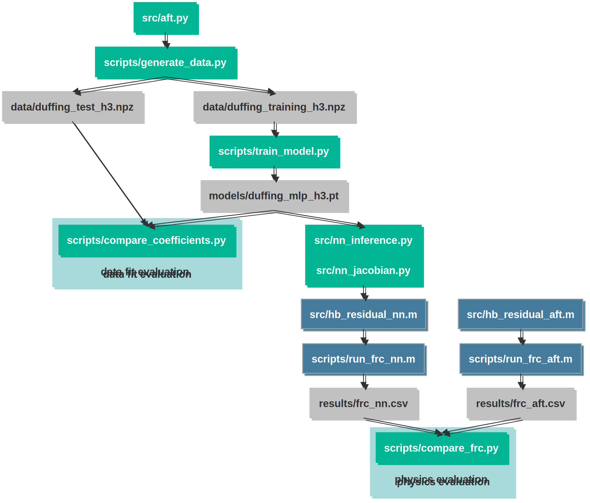

# gamm-duffing-hbm-nn
This repository accompanies the conference contribution:

**"Learning Duffing-Type Forces for the Harmonic Balance Method Using Neural Networks"**  
Presented at GAMM 2026.

**Authors**  
Miriam Goldack¹, Johann Groß², Malte Krack², Merten Stender¹  
¹Cyber-Physical Systems in Mechanical Engineering, Technische Universität Berlin, Germany  
²Institute of Aircraft Propulsion Systems, University of Stuttgart, Germany

**Abstract**  
Thin-walled lightweight structures often exhibit geometrically nonlinear behavior, which continues to pose challenges for accurate and efficient simulation. The Harmonic Balance Method (HBM) is a numerical simulation method and one of the most relevant approaches for modeling nonlinear structural dynamical systems. It represents the system response as a truncated Fourier series and effectively casts the equation of motion into the frequency domain. The main computational bottleneck is the evaluation of nonlinear forcing terms, for which the Alternating Frequency-Time (AFT) method is the standard approach. The AFT evaluates the nonlinear force in time domain and hence requires both an inverse Fourier Transform (FT) and a forward FT, which overall is computationally demanding.

In this work, we propose to replace the AFT with a neural network architecture trained for a specific type of contact nonlinearity, a cubic stiffness, and a fixed number of harmonics. It takes normalized Fourier coefficients of the displacement as input and outputs the corresponding nonlinear force Fourier coefficients without making use of the FT. Proof-of-concept studies on the Duffing oscillator demonstrate that the neural network can accurately learn the mapping and even provide the derivatives of the nonlinear forcing coefficients with respect to the displacement coefficients through automatic differentiation. The resulting Jacobian can then be used directly, leading to a more efficient and better-conditioned (iterative) solution process. Prediction errors are evaluated in terms of the data fit (i.e. matching coefficients computed by the AFT), but also in terms of the resulting system response (i.e. integrating the neural AFT into the classical HBM procedure).

## Requirements & Installation

The project was developed with:

- Python 3.12.11  
- MATLAB R2025a  

Install the required Python packages:

```bash
pip install -r requirements.txt
```

From the top-level repository directory (where `pyproject.toml` is located), install the package in editable mode to make the `src` modules importable from anywhere:

```bash
pip install -e .
```

## Workflow Overview
The diagram below summarizes the overall process, including data generation, neural network training, and evaluation at both the coefficient level and within the physical model integration.  
[](gamm_duffing_hbm_nn.svg)

## License
GNU General Public License v3.0

## Contact
Miriam Goldack  
CPS-ME, TU Berlin  
m.goldack@tu-berlin.de
